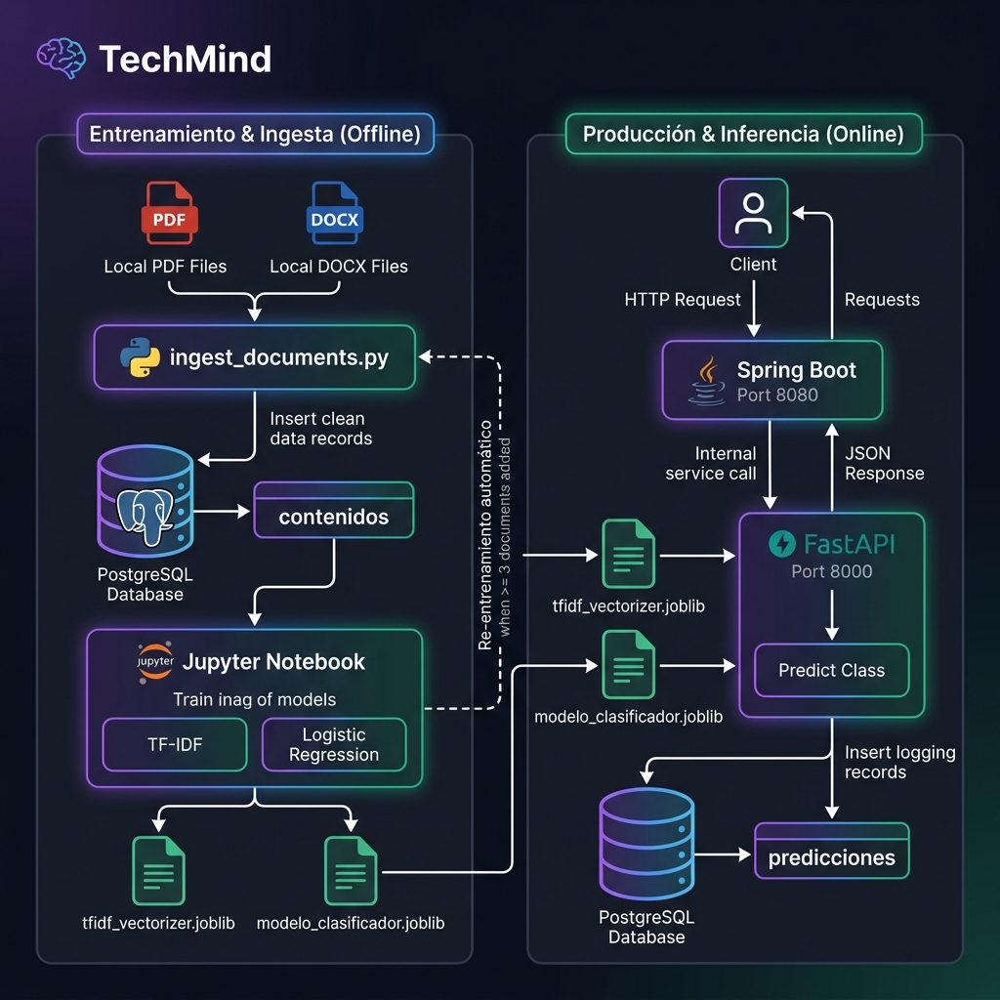

<div align="center">

# 🧠 TechMind
### Organización Inteligente del Conocimiento Técnico

[](https://www.python.org/)
[](https://scikit-learn.org/)
[](https://www.postgresql.org/)
[](https://jupyter.org/)
[](https://www.oracle.com/cloud/)
[](https://github.com/No-Country-simulation/g9-latam-techmind-team37)

**Hackathon TechMind · G9 LATAM · Equipo 37**

</div>

---

## 📌 ¿Qué es TechMind?

TechMind es un sistema de **organización inteligente de contenido técnico**. Dado el título y texto de un artículo, documentación o apunte técnico, el sistema responde automáticamente con:

- 📂 La **categoría temática** del contenido (Backend, Data Science, DevOps, etc.)
- 📊 La **probabilidad** de esa clasificación
- 🔑 Las **palabras clave** más relevantes del texto

Todo en formato JSON, listo para ser consumido por la API REST del equipo.

```json
{
  "categoria": "Backend",
  "probabilidad": 0.8879,
  "informaciones_adicionales": ["spring boot", "java", "api rest", "creación apis", "spring"]
}
```

---

## 🏗️ Arquitectura del Proyecto

```
  Postman / Cliente
       │  POST /contenido
       ▼
┌──────────────────────────────────┐
│   Spring Boot — Puerto 8080      │
└───────────────┬──────────────────┘
                │  HTTP interno POST /predecir
                ▼
┌──────────────────────────────────┐
│   FastAPI (Python) — Puerto 8000 │
│   TF-IDF + Regresión Logística   │
└──────────┬───────────────────────┘
           │
           ▼
┌──────────────────────────────────┐
│   PostgreSQL — Puerto 5432       │
│   contenidos · predicciones      │
└──────────────────────────────────┘
```

| Componente | Tecnología | Responsable |
|-----------|-----------|-------------|
| **Ciencia de Datos** | Python · Scikit-Learn · FastAPI | Ernesto |
| **Back-End** | Java · Spring Boot | Equipo Backend |
| **Nube** | Oracle Cloud Infrastructure (OCI) | Todo el equipo |

---

## 📁 Estructura del Repositorio

```
tech-mind/
│
├── app/                            # Microservicio FastAPI (Backend Python)
│   ├── __init__.py
│   ├── main.py                     # API REST: /predecir, /health, /categorias
│   └── database.py                 # Conexión PostgreSQL y registro de predicciones
│
├── documentos/                     # PDFs / DOCXs para ingesta masiva
│
├── data-science/                   # Módulo de Ciencia de Datos y Machine Learning
│   ├── data/
│   │   ├── raw/
│   │   │   └── contenidos_tecnicos.csv    # Dataset inicial de entrenamiento
│   │   └── processed/              # Datos procesados / intermedios
│   │
│   ├── notebooks/
│   │   └── TechMind_DataScience.ipynb     # Notebook Jupyter principal
│   │
│   ├── src/
│   │   ├── ingest_documents.py     # Script para ingestión de PDFs/DOCXs
│   │   └── migrate_to_postgres.py  # Script de migración CSV -> PostgreSQL
│   │
│   ├── models/
│   │   ├── modelo_clasificador.joblib     # Modelo binario serializado
│   │   └── tfidf_vectorizer.joblib        # Vectorizador TF-IDF serializado
│   │
│   ├── docs/                       # Documentación técnica de Data Science
│   │   ├── BACKEND_INTEGRATION.md
│   │   ├── DIAGRAMA_PIPELINE.md
│   │   ├── INGESTA_DOCUMENTOS.md
│   │   ├── EXPLICACION_PROYECTO.md
│   │   ├── REQUIREMENTS.md
│   │   ├── ROADMAP.md
│   │   └── CHANGELOG.md
│   │
│   ├── assets/
│   │   └── pipeline_flowchart.png  # Diagrama de flujo del pipeline
│   │
│   ├── requirements.txt            # Dependencias de Python
│   └── README.md                   # Documentación específica del módulo DS
│
├── docker-compose.yml              # Servidor PostgreSQL 16
├── .env.example                    # Plantilla de variables de entorno
├── .gitignore
└── README.md                       # Documentación principal del repositorio
```

---

## 🚀 Cómo ejecutar el proyecto

### 1. Clonar el repositorio

```bash
git clone https://github.com/No-Country-simulation/g9-latam-techmind-team37.git
```

```bash
cd g9-latam-techmind-team37/data-science
```

### 2. Crear entorno virtual e instalar dependencias

```bash
py -m venv venv # venv\Scripts\activate
```

```bash
pip install -r requirements.txt
```

### 3. Levantar PostgreSQL con Docker

```bash
docker-compose up -d # PostgreSQL disponible en localhost:5432
```

### 4. Configurar variables de entorno y migrar datos

```bash
cd ..
```

```bash
cp .env.example .env
```

```bash
py data-science/src/migrate_to_postgres.py
```

### 5. Iniciar la API FastAPI

```bash
uvicorn app.main:app --reload --port 8000
```

---

## 🧪 Pipeline de Ciencia de Datos



| Paso | Descripción | Función / Herramienta |
|------|-------------|----------------------|
| 1 | **Carga de datos** desde PostgreSQL (`contenidos`) | `pd.read_sql_query()` |
| 2 | **EDA** — distribución de categorías, longitud de textos, nulos | `matplotlib` / `seaborn` |
| 3 | **Preprocesamiento** — minúsculas, remover puntuación, stopwords | `limpiar_texto()` |
| 4 | **Vectorización TF-IDF** — unigramas y bigramas, max 1500 features | `TfidfVectorizer` |
| 5a | **Entrenamiento** — Regresión Logística balanceada | `LogisticRegression` |
| 5b | **Extracción de keywords** — top 5 tokens por peso TF-IDF | `extraer_keywords()` |
| 6 | **Evaluación** — accuracy, precision/recall/F1 | `classification_report` |
| 7 | **Serialización** de artefactos en `data-science/models/` | `joblib.dump()` |

> Ver [`data-science/docs/DIAGRAMA_PIPELINE.md`](data-science/docs/DIAGRAMA_PIPELINE.md) para el diagrama interactivo Mermaid.

---

## 📬 Contrato de la API

### Endpoint: `POST /predecir`

**Request:**
```json
{
  "titulo": "Introducción a Spring Boot",
  "texto": "Conceptos básicos para la creación de APIs REST con Java y Spring Boot."
}
```

**Response:**
```json
{
  "categoria": "Backend",
  "probabilidad": 0.8879,
  "informaciones_adicionales": ["spring boot", "java", "api rest", "creación apis", "spring"]
}
```

---

## 📚 Documentación Técnica

- Guía de integración Java/Spring Boot: [`data-science/docs/BACKEND_INTEGRATION.md`](data-science/docs/BACKEND_INTEGRATION.md)
- Guía de entrenamiento y ejecución del modelo: [`data-science/docs/ENTRENAMIENTO_Y_EJECUCION.md`](data-science/docs/ENTRENAMIENTO_Y_EJECUCION.md)
- Ingesta de documentos PDF/DOCX: [`data-science/docs/INGESTA_DOCUMENTOS.md`](data-science/docs/INGESTA_DOCUMENTOS.md)
- Diagrama interactivo del pipeline: [`data-science/docs/DIAGRAMA_PIPELINE.md`](data-science/docs/DIAGRAMA_PIPELINE.md)
- Explicación conceptual para presentaciones: [`data-science/docs/EXPLICACION_PROYECTO.md`](data-science/docs/EXPLICACION_PROYECTO.md)
- Requerimientos técnicos: [`data-science/docs/REQUIREMENTS.md`](data-science/docs/REQUIREMENTS.md)

---

## 👥 Equipo

| Rol | Tecnología | Integrante |
|-----|-----------|-----------|
| **Ciencia de Datos** | Python · Scikit-Learn · FastAPI · PostgreSQL | Equipo Data Science |
| **Back-End** | Java · Spring Boot | Equipo Backend |
| **Cloud** | Oracle Cloud Infrastructure | Todo el equipo |

---

<div align="center">

**TechMind · Hackathon G9 LATAM · Equipo 37**

</div>
