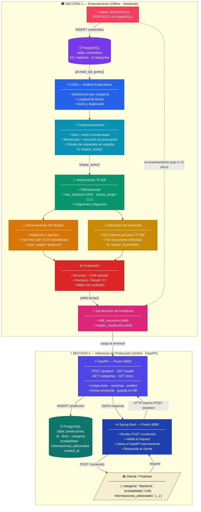

# 📊 TechMind — Diagrama del Pipeline de Ciencia de Datos

> Versión **v0.5** — refleja la arquitectura actual con FastAPI + PostgreSQL + Spring Boot + Ingesta.
> Útil para el equipo de Back-End al integrarse con el componente de DS.

---

## Diagrama visual


---

## Diagrama interactivo (Mermaid)

> Renderizable en GitHub, Notion, GitLab y editores compatibles con Mermaid.



---

## Descripción de cada paso

### Sección 1 — Entrenamiento (corre en el notebook)

| Paso | Nombre | Entrada | Salida | Herramienta |
|------|--------|---------|--------|-------------|
| 0 | **Ingesta de datos (opcional)** | Carpeta `documentos/` (PDF/DOCX) | PostgreSQL (`contenidos`) | `ingest_documents.py` |
| 1 | **Fuente de datos** | `techmind` (PostgreSQL) | `DataFrame` pandas | `pd.read_sql_query()` |
| 2 | **EDA** | `DataFrame` | Gráficos + estadísticas | `matplotlib` / `seaborn` |
| 3 | **Preprocesamiento** | `titulo` + `texto` | `texto_limpio` | `limpiar_texto()` |
| 4 | **Vectorización TF-IDF** | `texto_limpio` | Matriz numérica dispersa | `TfidfVectorizer` |
| 5a | **Entrenamiento** | Matriz (train) | Modelo entrenado | `LogisticRegression` |
| 5b | **Keywords** | Matriz (doc individual) | Lista de términos | `extraer_keywords()` |
| 6 | **Evaluación** | Modelo + test set | Métricas | `classification_report` |
| 7 | **Serialización** | Modelo + vectorizador | `.joblib` en disco | `joblib.dump()` |

### Sección 2 — Inferencia en Producción

| Paso | Nombre | Entrada | Salida | Servicio |
|------|--------|---------|--------|---------|
| 8 | **FastAPI arranca** | `.joblib` desde disco | Modelo en memoria | `uvicorn app.main:app` |
| 9 | **Spring Boot llama** | `{ titulo, texto }` | `{ categoria, probabilidad, keywords }` | `POST /predecir` |
| 10 | **Log en PostgreSQL** | Predicción | Registro en `predicciones` | `app/database.py` |
| 11 | **Respuesta al cliente** | JSON de FastAPI | JSON al cliente/Postman | Spring Boot `POST /contenido` |

---

## Contrato de la API interna (FastAPI → Spring Boot)

### `POST http://localhost:8000/predecir`

**Request:**
```json
{
  "titulo": "Introducción a Spring Boot",
  "texto": "Conceptos básicos para la creación de APIs REST con Java y Spring Boot."
}
```

**Response (200 OK):**
```json
{
  "categoria": "Backend",
  "probabilidad": 0.8879,
  "informaciones_adicionales": ["spring boot", "java", "api rest", "creación apis", "spring"]
}
```

| Campo | Tipo | Descripción |
|-------|------|-------------|
| `categoria` | `string` | Una de las 8 categorías del modelo |
| `probabilidad` | `float` (0–1) | Confianza del modelo (softmax de LogReg) |
| `informaciones_adicionales` | `string[]` | Top 5 keywords por peso TF-IDF del documento |

---

## Tablas PostgreSQL involucradas

```sql
-- Datos de entrenamiento (lectura por el notebook)
contenidos (id, titulo, texto, categoria, created_at)

-- Log de inferencias (escritura por FastAPI en cada predicción)
predicciones (id, titulo, texto, categoria, probabilidad, informaciones_adicionales[], created_at)
```

---

*Diagrama actualizado el 2026-07-21 — v0.5 · TechMind G9 LATAM Team 37 · Rol: Ciencia de Datos.*
