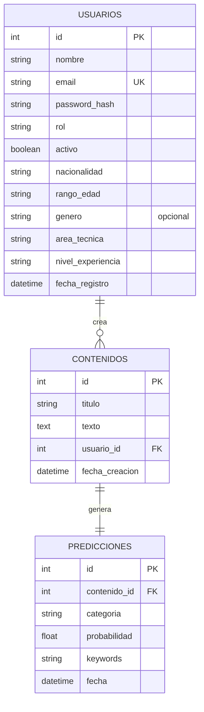

# Propuesta DER — Módulo de Usuarios y Contraseñas

**Autor:** Romulo Garcia Maygua · **Fecha:** 29/07/2026 · **Estado:** Borrador para discutir en sprint

## Contexto

En el sprint de hoy se planteó la posibilidad de sumar un módulo de usuarios y contraseñas al proyecto. Esta propuesta conecta ese módulo nuevo con las tablas que ya existen (`contenidos`, `predicciones`), en vez de dejarlo aislado — así cada contenido clasificado queda asociado a quién lo subió.

## Descripción general del DER

Este diagrama de Entidad-Relación (DER) representa cómo se van a guardar y conectar tres tipos de información en la base de datos:

- **Quién usa la plataforma** (`USUARIOS`): datos de cuenta (nombre, email, contraseña) y datos de perfil (nacionalidad, rango de edad, género, área técnica, nivel de experiencia) para poder segmentar estadísticas más adelante.
- **Qué conocimiento se sube** (`CONTENIDOS`): el texto técnico que cada usuario ingresa, tal cual lo escribió, antes de pasar por el modelo de IA.
- **Qué dice el modelo sobre eso** (`PREDICCIONES`): el resultado de clasificar ese contenido — categoría, probabilidad y palabras clave.

La idea central del diseño es que el conocimiento cargado por cualquier usuario quede disponible para **todo el equipo, no aislado por persona** — esto está alineado con el objetivo original del proyecto (ver conclusión más abajo). El campo `usuario_id` sirve para trazabilidad y estadísticas (saber quién subió qué), no para restringir quién puede ver o buscar ese contenido.

## Cómo se leen las relaciones

- **`USUARIOS ||--o{ CONTENIDOS : crea`** → un usuario puede crear muchos contenidos (o ninguno todavía), pero cada contenido pertenece a un único usuario. Relación uno a muchos.
- **`CONTENIDOS ||--|| PREDICCIONES : genera`** → cada contenido genera exactamente una predicción, y cada predicción corresponde a exactamente un contenido. Relación uno a uno.

## Diagrama

## Campos de perfil agregados para estadísticas

- **`nacionalidad`** y **`rango_edad`** — permiten segmentar el uso de la plataforma por origen y franja etaria.
- **`genero`** — opcional de completar, no obligatorio en el registro.
- **`area_tecnica`** (ej: Backend, Data Science, Frontend, DevOps, QA) — perfil técnico autodeclarado del usuario.
- **`nivel_experiencia`** (ej: estudiante, junior, semi-senior, senior) — sirve para cruzar qué tipo de perfil usa más la plataforma y qué categorías consulta cada uno.

Estos dos últimos son los más valiosos para el futuro dashboard: permiten responder preguntas como "¿qué perfil técnico clasifica más contenido de una categoría en particular?".

## Decisiones de diseño

- **`password_hash`**, nunca la contraseña en texto plano. Se recomienda `bcrypt` o similar.
- **Rol simple** (`admin` / `usuario`) en vez de una tabla de roles separada, para mantener el alcance acorde a un MVP de hackathon.
- **`activo` (booleano)** en lugar de borrar usuarios, para poder desactivarlos sin perder el historial de contenidos que subieron.
- **Relación uno a muchos** entre `USUARIOS` y `CONTENIDOS`: un usuario puede crear muchos contenidos; cada contenido pertenece a un solo usuario.

## Conocimiento compartido, no privado por usuario

Surgió la duda de si la búsqueda debería mostrar solo el contenido que subió cada usuario, o todo el contenido cargado por el equipo. La definición original del proyecto resuelve esto: TechMind está pensado para plataformas y comunidades técnicas que necesitan **organizar, buscar y reutilizar el conocimiento de forma eficiente**, y explícitamente busca **facilitar el intercambio de conocimiento** entre quienes usan la plataforma — no crear silos individuales.

**Conclusión: el buscador debe consultar el contenido cargado por todos los usuarios, no solo el propio.** `usuario_id` se usa para saber quién subió qué (trazabilidad, estadísticas), no como filtro de acceso. Si más adelante se necesita contenido privado, se puede sumar un campo `visibilidad` (público/privado) — pero no es parte de este MVP.

## Preguntas abiertas para el sprint

1. ¿Necesitamos roles más granulares (admin / editor / lector) o alcanza con admin/usuario para el MVP?
2. ¿El login va a manejarse con JWT (token de sesión) o con un mecanismo más simple dado el tiempo disponible?
3. ¿Un flujo de "olvidé mi contraseña" entra en el alcance del hackathon, o queda para después?
4. ¿`usuario_id` en `contenidos` debería ser obligatorio (`NOT NULL`) o permitir contenidos sin usuario asociado (por ejemplo, los ya cargados antes de este módulo)?
5. ¿`area_tecnica` y `nivel_experiencia` deberían ser una lista fija (dropdown) o texto libre? Un dropdown facilita las estadísticas después, pero limita las opciones disponibles.

## Próximos pasos (post-sprint)

- Una vez acordado el esquema, migrar la tabla `usuarios` a PostgreSQL.
- Definir con Backend qué endpoints de autenticación se necesitan (`/registro`, `/login`, etc.).
- Evaluar con el equipo si esto habilita también un dashboard de actividad por usuario, usando los datos ya recolectados en `predicciones`.
